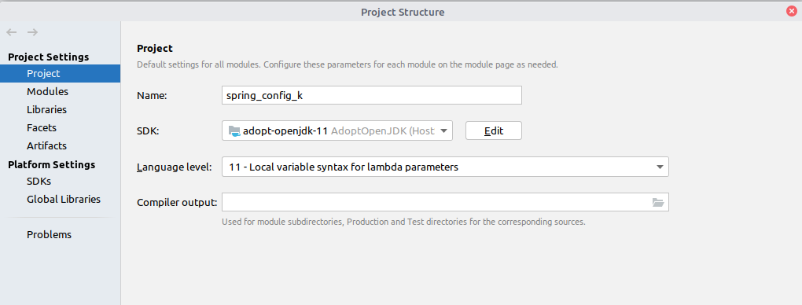

Различные способы задания конфигурации Spring Beans с Kotlin
----------------

Для чего этот проект? Для подготовки опытов с проектом с [Camel](https://github.com/cherepakhin/camel_rest).

Аналогичный проект на java [https://github.com/cherepakhin/spring_config](https://github.com/cherepakhin/spring_config)

1. [Установки для Java 11](#set_java_version)
2. [Настройки Spring beans с помощью xml-файла resources/beans.xml](#xml_file)
3. [Настройки Spring beans с помощью аннотаций @Configuration и @Bean в conf/ConfigFromJava](#configuration)

<a id="set_java_version"></a>
### 1. Установки для Java 11.

Использована Java 11. 

````shell
$ echo $JAVA_HOME
> /usr/lib/jvm/java-1.11.0-openjdk-amd64

````

Для установки выполнить:

````shell
export JAVA_HOME=/usr/lib/jvm/java-1.11.0-openjdk-amd64
````

В Idea установить File->Project Structure->Project Settings->Project->SDK



<a id="xml_file"></a>
### 2. Настройки Spring beans с помощью xml-файла resources/beans.xml.

Определение beans в [resources/beans.xml](https://github.com/cherepakhin/spring_config_k/blob/main/src/main/resources/beans.xml):

````xml

<bean id="russianGreeter" class="ru.perm.v.springconfig_k.greeters.RussianGreeter"/>
<bean id="germanyGreeter" class="ru.perm.v.springconfig_k.greeters.GermanyGreeter"/>
<bean id="englishGreeter" class="ru.perm.v.springconfig_k.greeters.EnglishGreeter"/>

<bean id="selectedGreeterService" class="ru.perm.v.springconfig.service.GreeterService">
<property name="greeter" ref="russianGreeter"/>
</bean>
````

Для импортирования бинов, определенных в beans.xml, создан класс:

````kotlin
package ru.perm.v.springconfig_k.conf

@Configuration
@ImportResource("classpath*:beans.xml")
class BeansFromXmlConfiguration {
}
````

<a id="configuration"></a>
### 3. С помощью аннотаций @Configuration и @Bean в [conf/BeansFromCodeConfiguration.kt](https://github.com/cherepakhin/spring_config_k/blob/master/src/main/kotlin/ru/perm/v/springconfig_k/conf/BeansFromCodeConfiguration.kt).

````kotlin
@Configuration
class BeansFromCodeConfiguration {

    /**
     * for injection use
     * @Autowired
     * lateinit var staticBean:String
     */
    @Bean("staticBean")
    fun getMyStaticBean() = "STATIC_BEAN"

    @Bean
    fun beanOneConfigFromCode() = "BEAN_ONE"

````
### Примечания.

Используется Java 11:

````shell
~/prog/kotlin/spring_config_k$ export JAVA_HOME=/usr/lib/jvm/java-1.11.0-openjdk-amd64
~/prog/kotlin/spring_config_k$ ./gradlew clean test
````